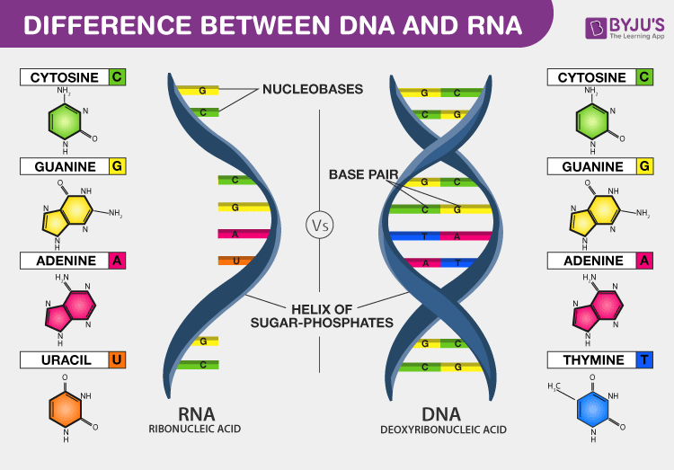
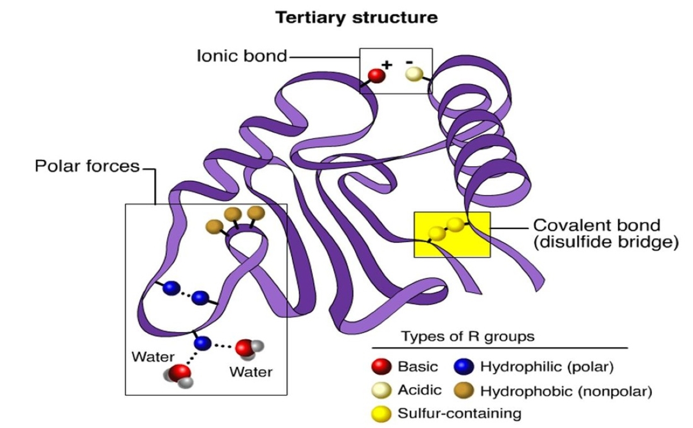

# AP biology 
## Biochemistry (Macromolecules) - Part 3 

### Chapter 3 pp 64-68 

### 1. Nucleic Acids
A. *Monomers* are called **Nucleotides**
B. *Polymers* are called **DNA or RNA**- It depends on the 5 Carbon sugar present in the monomer 
1. DNA has *Deoxyribose* for the 5 Carbon sugar.
2. RNA has *Ribose* for the 5 Carbon sugar. 

C. These are the *source of genes and heredithy information primarily.*

D. Two Types
1. **DNA**- This polymer is the " Master Million Dollar Blueprint ". It is kept "safe" in the nucleus. ( Nucleus is like a vault to keep the DNA in.)
2. **RNA**- This polymer is like a "cheap 10 cent copy" of the "Master Million Dollar Blueprint". It is disposable/recyclable. It makes messenger RNa and other RNA molecules.

E. **Primidines** (C,T,U)
1. Big name small molecule. (These have 1 Carbon ring in the Nitrogen base.)
2. "**C**limbing **T**akes you **U**p the **Pyramid** is the easy way to remember them. 

F. **Purines** (A,G)
1. Small name big molecule. (These have 2 Carbon rings in the Nitrogen base.)
2. "**A**labama is **Pu**rely **G**reater than **A**uburn" or "**A**uburn is **Pu**rely **G**reater than **A**labama" i an easy way to remember. It just depends on who you like more. 

G. *It is Always* a pyrimidine paired with purine.

H.Individual nucelotides joined by a *covalent bond* called a **Phosphodiester bond**. The *phosphate* one nucleotide is joined with the *5 carbon sugar* of the previous nucleotide.

I. **THE SEQUENCE DETERMINES WHAT PROTEIN OR ENZYME IS MADE**
1. Structure = Function and Emergent a Properties are themes related to Nucleic Acids too. 
2. That is why it is the "BLUEPRINT". 

## 2. DNA Double Helix Structure 
A. James Watson and Francis Crick make the model in 1953.
B. The two sides of DNA strands are said to be **complimentary** (They fit together perfectly)
C. One side has information to make proteins and enzymes(The Million Dollar Blueprint);other side is a *protective cape* for the Million Dollar Blueprint. It protects the SEQUENCE of nucleotides. The sides *alternate* on each strand.

## 3. Genes and Evolution
A. The more Nucleotide sequence "genes" in common; the *more cloesly related* the organisms are. 
B. The fewer Nucleotides sequence "genes" in common: the *more distantly related* they are.

## 4. Phosphorus Cycle
The Phosphorus is initially a component of rock. As As the rock breaks down over time, called **weathering**, the Phosphorus is released into the soil. Some dissolves into the water as the rains pass through the soil. This Phosphorus makes its way into bodies of water, such as lakes and oceans, and is available for producers (phytoplankton) to use to help make organic compounds such as phospholipids and DNA or RNA. Plants (also producers) can also retrieve the Phosphorus from the soil and use it to make organic compounds too. When organisms die, decomposers break down the bodies and return the Phosphorus back to the soil to be reused. 
