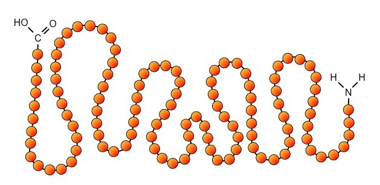
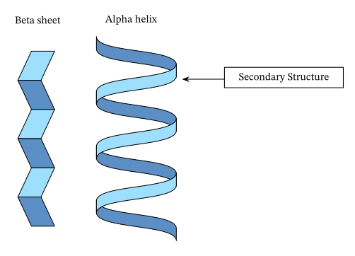
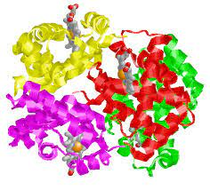

# Structure and Function of Bio-Marcomolecules
--- 
- Proteins comprise linear chains of amino acids
- Amino Acids are held together by covalent bonds

## Primary Structure
Determined by a sequence of amino acids held together by covalent bonds

 

## Secondary Structure
Through local folding of amino acids chains (alpha helixs, beta pleated sheets)

## Tertiary Structure 
Overall 3D shape of the protein 

## Quarternary Structure
Arises from interactions between multiple polypeptide units 

